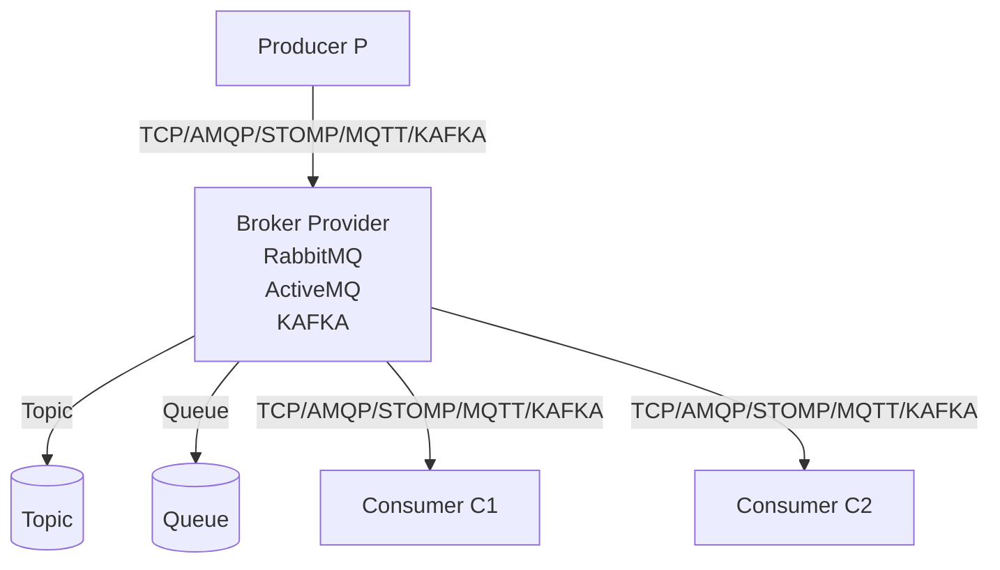
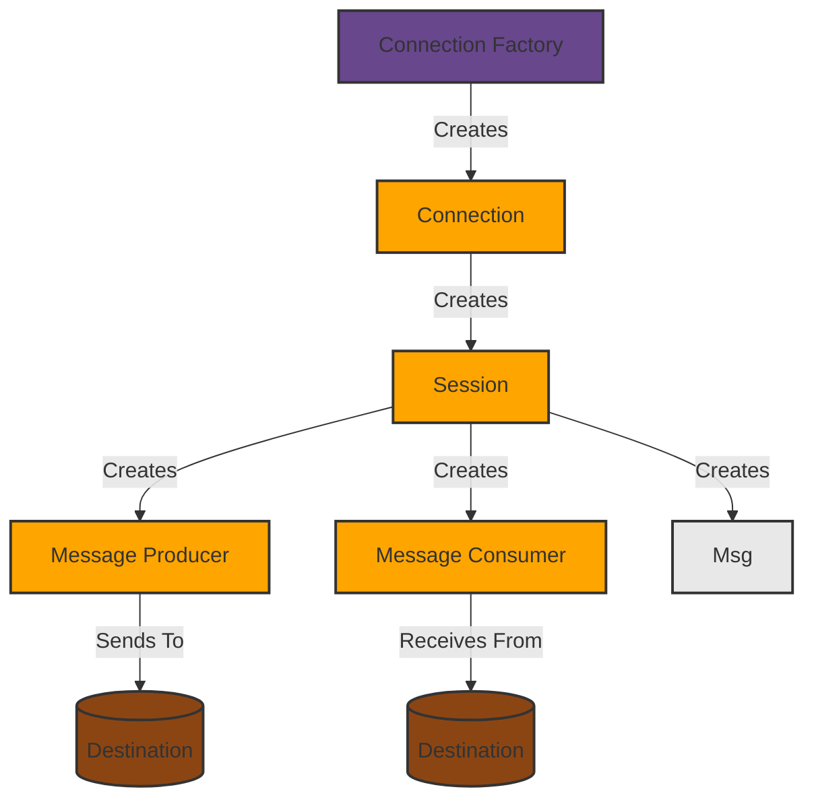

# # Modèle de systèmes distribués asynchrone



# Le modèle de programmation JMS


2 protocoles de communication:
- **Queue**: un message est envoyé à un seul consommateur.
    - une seule application qui va recevoir le message.
    - communication point à point. (one to one)
    - si on a plusieurs consommateurs, on va fair le tour du role.
- **Topic**: un message est envoyé à plusieurs consommateurs.
    - plusieurs applications qui vont recevoir le message.
    - communication de type broadcast. (one to many)
    - Publisher/Subscriber.

JMS fournit un modèle de programmation pour les applications Java qui permet de créer, envoyer, recevoir et lire des messages. C'est une API JEE qui permet de communiquer entre applications distribuées et possède plusieurs implémentations comme ActiveMQ, RabbitMQ, KAFKA, etc.

# Listner JMS: Coté Application Spring

```java
@Component
public class JmsListener {

    @JmsListener(destination = "queue")
    public void receiveQueue(String text) {
        System.out.println("Received: " + text);
    }

    @JmsListener(destination = "topic")
    public void receiveTopic(String text) {
        System.out.println("Received: " + text);
    }
}
```

# Producer JMS: Coté Application Spring

```java
@Component
public class JmsProducer {

    @Autowired
    private JmsTemplate jmsTemplate;

    public void sendQueue(String text) {
        jmsTemplate.convertAndSend("queue", text);
    }

    public void sendTopic(String text) {
        jmsTemplate.convertAndSend("topic", text);
    }
}
```

# Kafka

L'inconvénient de JMS est qu'il se base sur la méthode push, c'est-à-dire que le broker va envoyer le message au consommateur. C'est comme un château d'eau où le consommateur n'aurait pas de robinet pour contrôler le débit d'eau. Kafka, lui, se base sur la méthode pull, c'est-à-dire que le consommateur va chercher le message chez le broker.

- Kafka est une plateforme de streaming distribuée développée en Scala et Java.
- Une plateforme de streaming possède 3 caractéristiques clés:
    - Permettre aux applications clientes Kafka de punliez et sabonnez à des flux d'enregistrements. Similaire à une file d'attente de messages ou à un système de messagerie d'entreprise comme les Brokers JMS (ActiveMQ) ou AMQP (RabbitMQ).
    - Stocker les flux d'enregistrements de manière durable et tolérante aux pannes.
    - Traiter les flux d'enregistrements en temps réel. (Real Time Stream Processing)
- On peut utiliser Kafka comme un store des événements.


## Les API de Kafka

Kafka a quatre API principales:

- **Producer API**: Permet à une application de publier un flux d'enregistrements vers un ou plusieurs Topics (Sujets) Kafka.

- **Consumer API**: Permet à une application de s'abonner à un ou plusieurs Topics et de traiter les flux d'enregistrements qui lui sont transmis.

- **Streams API**: Permet à une application d'agir en tant que processeur de flux, en:
- Consommant un flux d'entrée provenant d'un ou plusieurs Topics
- Transformant efficacement les flux d'entrée en flux de sortie
- Produisant un flux de sortie vers un ou plusieurs Topics en sortie.

- **Connector API**: Permet de créer et d'exécuter des producteurs ou des consommateurs réutilisables qui connectent des Topics Kafka à des applications ou des systèmes de données existants. Par exemple, un connecteur vers une base de données relationnelle peut capturer chaque modification apportée à une table.

Kafka fournit des API clientes pour différents langages : Java, C++, Node JS, .NET, PHP, Python, etc.

```
JMS                             | Kafka
--------------------------------|--------------------------------
Queue/Topic based               | Log-based streaming platform
Point-to-point & Pub/sub        | Primarily pub/sub with partitions
Message acknowledgment          | Offset-based tracking
Message deletion after consume  | Retention-based message storage
Push-based                      | Pull-based
```

## Architecture de KAFKA

### ZooKeeper

- Kafka broker utilise ZooKeeper pour la gestion des brokers et la coordination.
- Il l'utilise également pour informer le producteur et le consommateur de la présence de nouveaux brokers ou de la défaillance d'un broker dans le système Kafka ou d'une défaillance du broker dans le système Kafka.

> Si vous vouliez démarrer un cluster Kafka, la première chose à faire est de démarrer un serveur ZooKeeper. Kafka utilise ZooKeeper pour stocker les métadonnées du cluster et pour les élire les leaders des partitions.

### Kafka Brokers

- Pour maintenir l'équilibre de la charge, le cluster Kafka est généralement composé de plusieurs Brokers dont un est élu comme Leader.

- Cependant, ils sont sans état, c'est pourquoi ils utilisent ZooKeeper pour conserver l'état du cluster.

- Une instance de Kafka Broker peut gérer des centaines de milliers de lectures et d'écritures par seconde.

- Chaque Broker peut gérer des To de messages.

### Consumers :

- Consomme les messages à partir des Topics.

- En utilisant l'offset de la partitions de Kafka Broker, le consommateur Kafka retient combien de messages ont été consommés parce que les Brokers Kafka sont sans état.

- Les utilisateurs peuvent rembobiner ou passer à n'importe quel point d'une partition.

- Chaque enregistrement publié dans un Topic est remis à une instance de consommateur au sein de chaque groupe de consommateurs abonné.

- Les instances de consommateur peuvent être dans des processus séparés ou sur des machines séparées.

- Si toutes les instances de consommateur ont le même groupe de consommateurs, la charge des enregistrements sera effectivement équilibrée sur les instances de consommateur.

- Si toutes les instances de consommateur ont des groupes de consommateurs différents, chaque enregistrement est alors diffusé vers tous les processus de consommation.

### Producers :

- Les producteurs de Kafka transmettent les données aux Brokers.

- Ces données sont à destination des Topics réparties en partitions dans les brokers du cluster.

- Le producteur est responsable du choix de l'enregistrement à affecter à quelle partition du cluster.


> Partionner pour **DISTRIBUER** et **REPLIQUER** pour **TOLÉRANCE AUX PANNES**.
> Partionnement c'est la division d'un Topic en plusieurs partitions.
> Réplication c'est la duplication des partitions sur plusieurs Brokers.
---

### **Resources:**

- [placeholder](https://www.placeholder.com)
