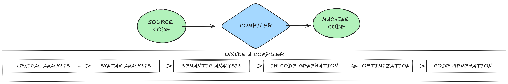
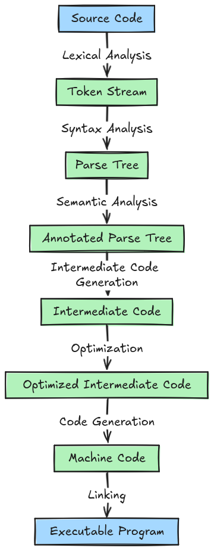

This project is part of the [Missing Semester cohort](https://www.missingsemester.io/) initiative that explores practical computer science concepts often overlooked in traditional curricula. Through this cohort, I learned a lot about compilers, distributed systems, and I also discovered the Go programming language, which became the foundation of my implementation.

## Introduction

This project proposes the development of a distributed virtual machine (VM) capable of executing programs written in a basic programming language. The VM will operate in a distributed system, where multiple nodes collaborate to run a program and reach a consensus on the final output. This project aims to explore the challenges and benefits of distributed computing through a simplified virtual machine framework.

## Goals

- **Develop a small virtual machine:** Design and implement a VM with a limited set of basic instructions suitable for educational or research purposes.
- **Implement a basic programming language:** Create a user-friendly language allowing programmers to write instructions for the VM.
- **Distribute the VM across a network:** Design a system where multiple nodes in a network can collaborate to execute a single program.
- **Implement a consensus mechanism:** Develop a protocol where participating nodes agree on the final output of a program, even in the presence of potential network failures or node malfunctions.

# COMPILERS

When I hear the word 'compiler' I instantly get intimidated. The idea of a compiler is surrounded by a lot of complexity and mystery. And actually they are complex, for example the LLVM & Clang projects currently consist of around 3 million lines of code. The GNU Compiler Collection, GCC, is even bigger. 15 million lines of code. So WHAT IS A COMPILER?

## WHAT IS A COMPILER?

“A compiler is computer software that transforms computer code written in one programming language (the source language) into another computer language (the target language). Compilers are a type of translator that support digital devices, primarily computers. The name compiler is primarily used for programs that translate source code from a high-level programming language to a lower level language (e.g., assembly language, object code, or machine code) to create an executable program.” - Wikipedia



### EXAMPLES OF COMPILERS

- **GCC (GNU Compiler Collection):** GCC is a powerful compiler that compiles code written in C, C++, and other languages to machine code.
- **Babel:** Babel is a JavaScript compiler that converts ECMAScript 2015+ code into a backwards-compatible version of JavaScript in current and older browsers or environments.
- **TypeScript:** TypeScript is a superset of JavaScript that compiles to plain JavaScript.
- **Java Compiler:** The Java compiler converts Java code into Java bytecode, which is then executed by the Java Virtual Machine (JVM).

### HOW DO COMPILERS WORK?

1. **Lexical Analysis:** The compiler breaks the source code into tokens (e.g., keywords, identifiers, operators).
2. **Syntax Analysis:** The compiler checks the syntax of the code to ensure it follows the rules of the programming language.
3. **Semantic Analysis:** The compiler checks the meaning of the code to ensure it is semantically correct.
4. **Intermediate Code (IR) Generation:** The compiler generates an intermediate representation of the code.
5. **Code Optimization:** The compiler optimizes the intermediate code to improve performance.
6. **Code Generation:** The compiler generates machine code or bytecode from the optimized intermediate code.



# VIRTUAL MACHINES

A virtual machine is a computer built with software. It’s a software entity that mimics how a computer works. And by software entity I mean it can be anything. A function, a struct, an object, a module, or even a whole program. What matters is what it does.

A virtual machine has a run loop that goes through the fetch-decode-execute cycle, just like a computer. It has a program counter; it fetches instructions; it decodes and executes them. It also has a stack, just like a real computer. Sometimes it has a call stack and sometimes even registers. All built in software.

In the context of this project, the Atlas Specifications are as follows:

- **Memory:** The VM will have a memory space where it can store data and instructions with the size of 1024 bytes, divided into:
- **Data Segment**: 512 bytes (addressable from 0 to 511) where the program can store variables and data.
- **Code Segment**: 512 bytes (addressable from 512 to 1023) where the program instructions are stored.
- **Addressing**: The VM will use a 8-bit addressing system to access memory locations.
- **Registers:** The VM will have a set of registers to store temporary data and addresses.
- **Program Counter (PC)**: A 8-bit register that points to the current instruction being executed.
- **Accumulator (ACC)**: A 8-bit register used to store intermediate results.
- **Stack:** The VM will have a stack to store return addresses and local variables. It will be implemented using a portion of the data segment. using LIFO (Last In, First Out) order.

## Instruction Set

AtlasVM uses a simple instruction set designed to support basic programming constructs. Each instruction is 1 byte long, with the first 4 bits representing the opcode and the remaining bits used for operands or addressing.

| Opcode (Hex) | Instruction | Description                                                       |
| ------------ | ----------- | ----------------------------------------------------------------- |
| 0x00         | ADD         | Add value at memory address to ACC                                |
| 0x01         | SUB         | Subtract value at memory address from ACC                         |
| 0x02         | MUL         | Multiply ACC by value at the memory address                       |
| 0x03         | DIV         | Divide ACC by value at memory address (remainder ignored)         |
| 0x04         | AND         | Perform bitwise AND between ACC and value at memory address       |
| 0x05         | OR          | Perform bitwise OR between ACC and value at memory address        |
| 0x06         | XOR         | Perform bitwise XOR between ACC and value at memory address       |
| 0x07         | LOAD        | Load value from memory address to ACC                             |
| 0x08         | STORE       | Store value from ACC to memory address                            |
| 0x09         | JUMP        | Unconditionally jump to the address specified in the next byte    |
| 0x0A         | JZ          | Jump to the address specified in the next byte if ACC is zero     |
| 0x0B         | JNZ         | Jump to the address specified in the next byte if ACC is not zero |
| 0x0C         | IN          | Read input from users and store it in ACC                         |
| 0x0D         | OUT         | Write value from ACC to output                                    |
| 0x0E         | HALT        | Terminate program execution                                       |

## Programming Language: AtlasPL

AtlasPL is a simple, C-like programming language designed to compile to AtlasVM bytecode. It supports basic arithmetic operations, variables, conditionals, and loops.

Example AtlasPL code:

```c
@ This program checks if a number is even.
var number: int;

number = 10; @ Assign a value to number

if ((number & 1) == 0) { @ Check if last bit is 0 (even)
  return (0);
} else {
  return (1);
}
```

## From Source to Bytecode: Lexer, Parser, and Compiler

Turning AtlasPL text into runnable bytecode is a three-stage pipeline:

### 1. The Lexer

The lexer (or tokenizer) reads the raw source code character by character and groups them into meaningful **tokens**. For example, `number = 10;` becomes an `IDENTIFIER` ("number"), an `EQUAL` sign, an `INT` ("10"), and a `SEMICOLON`. The lexer abstracts away whitespace and comments, providing a clean stream of words for the next stage.

### 2. The Parser

The parser takes this flat stream of tokens and builds an **Abstract Syntax Tree (AST)** that captures the structure of the program. AtlasPL uses a technique called **Pratt parsing** (which is just a smart way to handle order of operations). This approach allows to easily understand the correct order of operations. It natively handles operator precedence, ensuring that expressions like `a + b * c` are correctly parsed as `a + (b * c)`.

### 3. The Compiler

The compiler walks the AST and emits a sequence of 1-byte instructions that the VM can execute. Because the VM's operand space is only 4 bits (allowing addresses 0–15), the compiler carefully packs variables and constants into a 16-slot data segment prefix:

- **0x00 – 0x05**: User variables
- **0x06 - 0x07**: Scratch registers for complex expressions
- **0x08 – 0x0F**: A constant pool for integer literals

When compiling our example, the instruction `number = 10;` allocates `number` at `0x00`, seeds the literal `10` into the constant pool at `0x08`, and emits:

```
LOAD 0x08   // ACC = memory[0x08] (which holds 10)
STORE 0x00  // memory[0x00] = ACC (number <- 10)
```

## VM Implementation: The Fetch-Decode-Execute Cycle

The AtlasVM is a simulated CPU implemented as a Go struct. It contains exactly what a physical CPU needs:

```go
type VM struct {
    Memory    *Memory
    Registers *Registers
    Stack     *Stack
    // running state and I/O handlers...
}
```

The VM struct encapsulates the core components of our virtual machine:

- **Memory**: 1024 bytes divided squarely into a Data Segment (for variables and constants) and a Code Segment (for runnable bytecode).
- **Registers**: Holds the Program Counter (`PC`) and Accumulator (`ACC`).
- **Stack**: Backed by the top of the Data Segment, moving downwards to avoid memory collisions with variables.

The heart of the VM is the **fetch-decode-execute loop**. This loop continually executes instructions until it hits `HALT`.

> meaning it first _grabs_ the next instruction from memory (fetch), _interprets_ what that instruction means (decode), and then _performs_ the action specified by that instruction (execute).

```go
func (vm *VM) Run() {
    vm.running = true
    for vm.running {
        // FETCH: Notice PC is a zero-based offset in the code segment
        raw := vm.Memory.Read(DataSegmentSize + uint16(vm.Registers.PC))

        // DECODE
        instruction := DecodeInstruction(raw)

        // ADVANCE PC (before execute, so jump instructions can legitimately override it)
        vm.Registers.PC++

        // EXECUTE
        vm.executeInstruction(instruction)
    }
}
```

This simple loop forms the foundation of all computation. The `executeInstruction` method operates as a massive switch statement that tweaks the Accumulator and Memory structures based on the specific opcode retrieved (such as `ADD`, `SUB`, `JUMP`, etc.).

## Distributed Execution and Consensus

A single VM instance constitutes a single point of failure. To make the system resilient, we distribute the VM processing power across a network. We ensure that multiple disparate nodes safely interact and process computations, collectively agreeing upon the outcome.

### The Node Platform

Each network participant wraps an independent instance of a VM and maintains robust connection links to its peers, forming a full-mesh topology constraint where every node holds a complete routing awareness of every other node.

```go
type Node struct {
    ID        string                  // unique name, e.g. "node1"
    Address   string                  // TCP address
    Peers     map[string]*NodeClient  // connected peer instances via gRPC
    VM        *vm.VM                  // isolated local VM
    consensus *Consensus              // PBFT consensus governor
}
```

### PBFT Consensus Mechanism

In a distributed framework, nodes run at different execution paces. Messages could be delayed over the network link, or certain nodes could misbehave completely (a scenario recognized in systems theory as a Byzantine fault). To securely guarantee that all honest participating nodes arrive precisely at the identical VM terminal state post-execution, AtlasVM implements a clean, simplified version of the **PBFT (Practical Byzantine Fault Tolerance)** algorithm.

This algorithm works structurally in a multi-phase commit model:

1. **PRE-PREPARE Phase**: The primary, designated "leader" node natively executes the source program to completion and broadcasts the explicitly proposed VM state layout (the totality of its byte memory sequence alongside its ending PC and ACC registers) to all replicas.
2. **PREPARE Phase**: Replica nodes receive this proposal block, verify its validity in context, and broadcast their formal matching `PREPARE` ticket to all global peers.
3. **COMMIT Phase**: Once an individual node amasses a required quorum (a pre-configured strict majority) of independent `PREPARE` votes matching the uniquely specific proposal hash, it formally switches stances by disseminating a broader `COMMIT` message.
4. **FINALIZE State**: Upon accumulating a distinct quorum of corresponding `COMMIT` messages from around the full network, the resulting state is permanently stamped. The native local VM is overridden to align with this finalized consensus output safely.

```go
type ConsensusState int

const (
    INITIAL ConsensusState = iota
    PrePrepare
    Prepare
    Commit
    Finalize
)

type Consensus struct {
    state          ConsensusState
    currentView    int64
    prepareCount   map[string]int  // State hash -> accumulated valid vote counts
    commitCount    map[string]int  // State hash -> accumulated valid vote counts
    decisionQuorum int
    decidedValue   *pb.ConsensusMessage
}
```

Instead of just trusting the fastest message they receive, the nodes in the network actually vote on the results. To do this efficiently, they use a hash function (SHA-256). Think of this as a digital fingerprint: it turns the entire VM memory into a short, unique string of characters.

Even if a single bit of data is different between two nodes, their "fingerprints" will look completely different. This makes it impossible for nodes to accidentally agree on the wrong data. By using this voting system (PBFT), the network stays decentralized and remains rock-solid even if some nodes fail or lie.

# COMMUNICATION BETWEEN NODES

In this project, all of our nodes (individual parts of our distributed system) are written in Go. Even though we're using just one language, we use Protocol Buffers and gRPC. Let's explore why we use these technologies and how they help us build a robust distributed system.

- **Protocol Buffers** is a language-agnostic data serialization format, meaning you can define your data structures once and generate code for multiple languages.It is developed by Google and allows you to define the structure of your data in a `.proto` file and generate code for serialization and deserialization in various languages. In the context of AtlasVM it helps us define the messages exchanged between nodes.
- **gRPC** is a high-performance, open-source framework developed by Google for efficient and language-agnostic communication between distributed systems. In AtlasVM, we use gRPC to facilitate communication between nodes in our distributed virtual machine.

## Protocol Buffers: Structured Data Definition

Protocol Buffers help us define our data structures in a clear, efficient way. In our `atlas.proto` file, we describe the format of messages that our nodes will exchange:

```protobuf
message VMState {
  bytes memory = 1;
  uint32 pc = 2;
  int32 acc = 3;
}
```

This defines a `VMState` message with three fields: `memory`, `pc`, and `acc`.

### The Protocol Buffers Compiler (protoc)

We use the `protoc` compiler to generate Go code from our `.proto` file:

```shell
protoc --go_out=. --go-grpc_out=. proto/atlas.proto
```

This creates Go structs and methods that match our Protocol Buffer definitions. The benefits include:

1. **Automatic Code Generation**: We don't have to manually write structs and serialization code.
2. **Type Safety**: The generated code ensures we're using the correct types for each field.
3. **Efficient Serialization**: Protocol Buffers provide a compact binary format for data exchange.

## gRPC: High-Performance RPC Framework

gRPC is a system for making remote procedure calls (RPC). In simpler terms, it allows one Go program to call functions on another Go program, even if they're running on different machines.

In our `atlas.proto` file, we define our gRPC service:

```protobuf
service NodeService {
  rpc ReceiveMessage(ConsensusMessage) returns (Empty);
}
```

This tells gRPC that our nodes can receive `ConsensusMessage` type messages.

The benefits of using gRPC in our Go project include:

1. **Code Generation**: gRPC generates client and server code, saving us from writing boilerplate networking code.
2. **Efficient Communication**: gRPC uses HTTP/2, which is faster and more efficient than older protocols.
3. **Streaming Support**: gRPC allows for advanced features like bi-directional streaming, which could be useful for continuous data exchange between nodes.

## How It Works in AtlasVM

1. We define our message structures and services in `atlas.proto`.
2. We use `protoc` to generate Go code (`atlas.pb.go` and `atlas_grpc.pb.go`).
3. In our node implementation, we use the generated code to create and handle messages:

```go
type NodeService struct {
    node *Node
    pb.UnimplementedNodeServiceServer
}

func (s *NodeService) ReceiveMessage(ctx context.Context, msg *pb.ConsensusMessage) (*pb.Empty, error) {
    // Handle the received message
    // ...
    return &pb.Empty{}, nil
}
```

4. When one node needs to send a message to another, it uses the generated client code:

```go
client := pb.NewNodeServiceClient(grpcConnection)
response, err := client.ReceiveMessage(context.Background(), consensusMessage)
```

By using gRPC and Protocol Buffers, we simplify the communication between nodes in our distributed virtual machine, making it easier to build a robust and efficient system.

---

The project is still a work in progress, but it has been a great learning experience in compilers, virtual machines, and distributed systems. You can find the full source code and documentation on [GitHub](https://github.com/HMZElidrissi/atlas-virtual-machine).

---

### **Resources:**

- [Missing Semester - Spring 2024 Cohort](https://www.youtube.com/playlist?list=PL7RELWF0lcJ_6J0Y3HH-5sqbWejfskfwp)
- [Building a compiler in Go - Thorsten Ball](https://compilerbook.com/)
- [Writing An Interpreter In Go — Thorsten Ball](https://interpreterbook.com/)
- [Designing Data-Intensive Applications — Martin Kleppmann](https://dataintensive.net/)
- [The PBFT paper — Castro & Liskov, 1999](http://pmg.csail.mit.edu/papers/osdi99.pdf)
- [gRPC documentation](https://grpc.io/docs/languages/go/)
- [Protocol Buffers guide](https://protobuf.dev/getting-started/gotutorial/)
