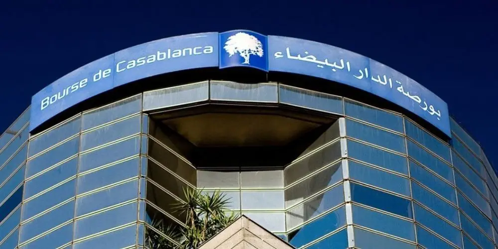

import Callout from "@/components/ui/callout";
import GlossaryTerm from "@/components/blog/bourse-casablanca-guide/glossary-term";
import GlossaryTable from "@/components/blog/bourse-casablanca-guide/glossary-table";
import Timeline from "@/components/blog/bourse-casablanca-guide/timeline";
import SectorChart from "@/components/blog/bourse-casablanca-guide/sector-chart";
import FICalculator from "@/components/blog/bourse-casablanca-guide/fi-calculator";
import CommissionCalc from "@/components/blog/bourse-casablanca-guide/commission-calc";
import CaseStudyCard from "@/components/blog/bourse-casablanca-guide/case-study-card";
import RoadmapStepper from "@/components/blog/bourse-casablanca-guide/roadmap-stepper";

From 19 to 25 November 2025, you probably saw a headline or an ad about Cash Plus sells its shares to the public stocks in the Bourse de Casablanca. The marketing campaign was everywhere (billboards, TV spots, social media ...) that I needed to know what is the deal with the bourse of Casablanca, is it a good place to invest? How does it work? What are the risks? And how can I get started? and as everything new I want to learn about it, I write documentation about it, and here we are.

So to start with, let's be clear: The Bourse de Casablanca is not Wall Street. It is smaller, less liquid, and more concentrated. But the underlying truth is the same. The market rewards patience, and punishes panic.

---

## Part I — The Foundation

Let's start with the right question. Most people ask: _"How do I make money in the stock market?"_

That's the wrong question.

The right question is: _"How do I build enough financial independence that I can choose how I spend
my time?"_

JL Collins called it F-You Money. That sounds aggressive, but the idea is simple. There's a number
— different for everyone — at which you have enough invested that you no longer _have_ to do anything
you don't want to do. You can say no to a bad job. You can take six months off. You can quit and
start over. Money, properly handled, buys options. And options are freedom.

You probably can't retire in five years on a Moroccan graduate salary. That's fine. The goal right
now isn't retirement. It's building a cushion. Building flexibility. Building the habit.

Here's the simplest version of what you need to do:

> **Spend less than you earn. Invest the surplus. Avoid debt. Let time do the rest.**

That's the whole guide, in one sentence. Everything that follows is just detail.

---

### The savings rate is the only variable that matters

Here's something nobody tells you at the beginning. Your investment returns matter far less than how
much you save.

A 30-year-old who saves 10% of their salary will reach financial independence about a decade later
than someone who saves 30% — regardless of whether their investments return 8% or 10%. The savings
rate dwarfs the difference.

This has a deeply inconvenient implication: you cannot invest your way out of overspending. You
cannot pick stocks clever enough to compensate for living beyond your means. The market is powerful,
but it is not magic.

The good news is that you actually control your savings rate. You do not control the market.

<FICalculator client:load />

Play with those numbers. Notice what happens to years-to-FI when you push your savings rate from
20% to 35%. Then notice what happens when you move the return slider from 8% to 12%. The savings
rate matters more. Always.

---

### Debt is the enemy

Carrying high-interest debt while trying to invest is like trying to fill a bucket with a large
hole in the bottom. You can pour as much in as you like; the hole wins.

If you have _crédit à la consommation_ at 15% interest, there is no investment on the Bourse de
Casablanca that reliably beats that. Paying it off is the best investment you can make. Full stop.

The rough rule:

- Below 3% interest → pay slowly, invest the difference
- Between 3–5% → your call; do what lets you sleep at night
- Above 5% → eliminate it before you buy a single share

Student debt in Morocco has its own dynamics, but the principle holds. High-interest debt is a
guaranteed negative return. It should terrify you far more than a market correction.

A side note on mortgages: a home is not an investment. It is a place to live, and it is expensive
in ways people consistently undercount — property taxes, maintenance, insurance, the opportunity
cost of the down payment, and the immense cost of upgrading when your life changes. Owning a home
may be the right decision for you at some point. Just don't confuse it with investing.

---

## Part II — Understanding the Bourse

### A brief history of Morocco's stock market

The Bourse de Casablanca is not new. It has survived world wars, decolonization, oil crises, the
dot-com crash, 2008, COVID, and two consecutive years of exceptional returns in 2024–2025. That
history matters. It tells you the market is resilient.

<Timeline
  client:load
  events={[
    {
      year: "1929",
      title: "Office de compensation des valeurs mobilières",
      desc: "Founded during the French Protectorate as a rudimentary exchange. Think open outcry, paper tickets, and a very small universe of securities.",
    },
    {
      year: "1948",
      title: "Office de Cotation des Valeurs Mobilières",
      desc: "Renamed and restructured. Still a pre-modern market by today's standards, but taking shape.",
    },
    {
      year: "1993",
      title: "The big reform",
      desc: "The pivotal year. Electronic trading arrives. The AMMC regulator is created. Sociétés de bourse are licensed. The modern Bourse is born.",
    },
    {
      year: "1997",
      title: "Maroclear created",
      desc: "A central depository is established for settlement and custody of securities — the plumbing that makes reliable ownership possible.",
    },
    {
      year: "2002",
      title: "MASI index launched",
      desc: "The Moroccan All Shares Index replaces the older IGB. Now every listed company is tracked in one benchmark.",
    },
    {
      year: "2008",
      title: "NSC V900 trading system",
      desc: "Casablanca adopts the same trading infrastructure as Euronext. The Bourse is now technologically aligned with European markets.",
    },
    {
      year: "2022–2025",
      title: "The IPO renaissance",
      desc: "After a decade of near-silence, listings return: Akdital, CFG Bank, CMGP, Vicenne, Cash Plus, SGTM. Investors re-engage. MASI climbs 22% in 2024, 27% in 2025.",
    },
    {
      year: "2025",
      title: "1,000 billion MAD milestone",
      desc: "Market capitalisation crosses 1 trillion dirhams for the first time. A symbolic threshold that signals a change in the Bourse's weight and visibility.",
    },
  ]}
/>

What does this history tell you? It tells you the market has been through difficult decades and
emerged. It tells you that the major structural improvements — electronic trading, central custody,
regulatory oversight — happened in the 1990s and have been stable since. It tells you the current
renaissance is not a fluke: it has foundation under it.

It does not tell you that the market can't fall 30% next year. It can. Plan for it.

---

### What the Bourse actually is

The Bourse de Casablanca is a <GlossaryTerm client:load term="Société Anonyme" french="société anonyme">A private joint-stock company — in this case, one whose capital is held by banks, the Caisse de Dépôt et de Gestion, independent brokers, and insurance companies. It operates under a _cahier des charges_ approved by the Ministry of Economy and Finance.</GlossaryTerm> operating under government supervision. It is the marketplace where shares of Morocco's major listed companies change hands every weekday between 9:30 and 15:30.

Three tiers of listing exist:

- **Marché Principal** — the large-caps. Attijariwafa Bank, Maroc Telecom, Managem. Strict capital
  and reporting requirements.
- **Marché Développement** — mid-size companies with growth ambitions and lighter requirements.
- **Marché Croissance / Alternatif** — for smaller companies and startups. Disty Technologies was
  one of the first real-world tests of this market.

The regulator overseeing all of this is the <GlossaryTerm client:load term="Autorité Marocaine du Marché des Capitaux" french="AMMC">The market authority responsible for investor protection, regulatory compliance, and market surveillance. Their website (ammc.ma) is where you find official filings from every listed company — annual reports, quarterly results, IPO prospectuses.</GlossaryTerm>. Think of the AMMC as the referee: they don't pick winners, but they make sure the game is played fairly.

---

### The market's sectors

The Bourse de Casablanca spans 24 sectors, but the weight is not evenly distributed. Two sectors
— _banques_ and _télécoms_ — account for more than half the market's capitalisation. This
concentration is both a feature and a risk.

<SectorChart client:load />

A few things worth noting in those numbers:

The _banques_ sector (32.6%) being the dominant weight means the Bourse is highly sensitive to the
health of Morocco's banking system. When Bank Al-Maghrib changes interest rates, the market feels it.

_Télécoms_ (17.7%) is essentially one company: Maroc Telecom. A single stock representing nearly a
fifth of the entire market is unusual concentration — though IAM is a genuinely large and profitable
business.

The exciting growth stories — _santé_, _BTP_, _mines_ — are smaller by weight but faster-moving.
They're where the big recent returns have come from.

---

## Part III — The Vocabulary You Need

You don't need to know everything. But you do need the basics, so you understand what you're doing
when you buy your first share.

<GlossaryTable
  client:load
  terms={[
    {
      french: "Action",
      english: "Share / stock",
      def: "A unit of ownership in a company. Own one share of Akdital and you own a tiny piece of that business — its profits, its growth, and its risks.",
    },
    {
      french: "Obligation",
      english: "Bond",
      def: "A loan you make to a company or government. They pay you fixed interest and return your principal at maturity. Less exciting than shares, but less volatile.",
    },
    {
      french: "MASI",
      english: "All-shares index",
      def: "The benchmark index tracking every listed company on the Bourse. If someone says 'the market was up 2% today,' they mean the MASI moved 2%.",
    },
    {
      french: "MADEX",
      english: "Active-shares index",
      def: "A narrower index of the most liquid stocks. Useful for tracking where the real trading activity is happening.",
    },
    {
      french: "PER",
      english: "Price-to-Earnings",
      def: "Share price divided by earnings per share. A PER of 18 means you're paying 18 dirhams for every 1 dirham of annual earnings. Lower can mean cheaper; higher can mean more growth expected.",
    },
    {
      french: "Dividende",
      english: "Dividend",
      def: "A portion of profits paid out to shareholders. Some companies pay them annually. If you own shares on the record date, you receive the payment.",
    },
    {
      french: "Capitalisation boursière",
      english: "Market cap",
      def: "Total value of all shares outstanding. Share price × number of shares. This is the market's real-time estimate of a company's worth.",
    },
    {
      french: "Introduction en Bourse",
      english: "IPO",
      def: "When a company lists for the first time. TGCC, Akdital, CFG Bank — all recent examples. IPOs are often oversubscribed, meaning demand exceeds supply.",
    },
    {
      french: "Ordre à cours limité",
      english: "Limit order",
      def: "You specify the maximum price you'll pay (or minimum you'll accept when selling). Your order only executes if the market reaches your price.",
    },
    {
      french: "Ordre au prix du marché",
      english: "Market order",
      def: "You accept whatever the current price is. Execution is guaranteed; price is not. Use with caution on illiquid stocks.",
    },
    {
      french: "J+3",
      english: "T+3 settlement",
      def: "Trades settle three business days after execution. Your shares arrive, and the seller's cash arrives, three days later via Maroclear.",
    },
    {
      french: "Avis d'opéré",
      english: "Trade confirmation",
      def: "The official notice from your broker confirming your order was executed. Keep these. They are your records.",
    },
    {
      french: "Société de Bourse",
      english: "Brokerage firm",
      def: "The licensed intermediary between you and the Bourse. You cannot buy shares directly — you go through a société de bourse (or your bank's brokerage arm).",
    },
    {
      french: "Rendement",
      english: "Dividend yield",
      def: "Annual dividend divided by share price, expressed as a percentage. A stock paying 5 MAD dividend at a price of 100 MAD has a 5% yield.",
    },
    {
      french: "Valeur de croissance",
      english: "Growth stock",
      def: "A company expected to grow faster than average. Usually reinvests profits rather than paying dividends. Akdital is a current example.",
    },
    {
      french: "Valeur de rendement",
      english: "Income stock",
      def: "A company that pays regular, predictable dividends. Maroc Telecom is the classic Moroccan example. Less exciting, more reliable.",
    },
    {
      french: "Carnet de commandes",
      english: "Order book / backlog",
      def: "For construction companies: their pipeline of signed contracts. A large carnet de commandes means predictable revenue ahead.",
    },
    {
      french: "Analyse fondamentale",
      english: "Fundamental analysis",
      def: "Studying a company's finances — revenue, earnings, debt, competitive position — to decide if the stock is worth buying at the current price.",
    },
    {
      french: "Analyse technique",
      english: "Technical analysis",
      def: "Using charts and price history to identify patterns and predict future moves. More art than science. Useful as one tool among many; dangerous as the only one.",
    },
  ]}
/>

---

## Part IV — Opening Your Account

### The mechanics

You cannot buy shares at the Bourse de Casablanca directly. You go through a

<GlossaryTerm client:load term="Société de Bourse" french="société de bourse">
  A licensed brokerage firm authorised to execute trades on the Bourse. Either a
  standalone firm (CDG Capital Bourse, CFG Marchés) or the brokerage arm of your
  bank (Wafabourse for Attijariwafa customers, BCP Bourse, etc.).
</GlossaryTerm>
— either a standalone brokerage firm or the brokerage division of your bank.

The process:

1. **Choose your intermediary.** Your existing bank is the path of least resistance. Wafabourse
   (Attijariwafa), BCP Bourse, BMCE Capital Bourse, CDG Capital Bourse, and CFG Marchés are the
   main options.
2. **Open a _compte titres_.** Fill out the forms. Bring your CIN and your _identifiant fiscal_
   (IF number). Sign the account agreement.
3. **Fund the account.** Transfer money from your current account. No legally mandated minimum,
   but most brokers have practical minimums of around 1,000–5,000 MAD.
4. **Get your login credentials.** Most brokers now have online platforms where you can place
   orders, track your portfolio, and access market data.

The whole process takes a week or two. It is not complicated.

### What it costs you

Every trade you make has three layers of fees:

<CommissionCalc client:load />

At 0.9% round-trip (buy + sell), the Bourse de Casablanca is more expensive per trade than a US
brokerage. This has an important strategic implication: **the Bourse rewards buy-and-hold investors
and punishes frequent traders.** Each time you buy and sell, 0.9% disappears. Do that twelve times
a year and you've given away nearly 11% to friction before the market even moves.

Collins's instinct — hold for years, not weeks — is even more applicable here than it was in the
US context.

---

## Part V — How to Buy and Sell

### The order types

When you place an order, you have a choice:

**Ordre au prix du marché** — you accept whatever price the market offers at that moment. Your
order will execute, but you don't know at exactly what price. Fine for liquid stocks like
Attijariwafa or Maroc Telecom. Dangerous for thinly traded stocks where a single order can move
the price.

**Ordre à cours limité** — you specify your price. You buy at that price or better, or not at all.
This is what most individual investors should use. It protects you from slippage on illiquid days.

### The settlement cycle

Place an order → order is matched on the Bourse → you get an _avis d'opéré_ → shares and cash
settle on J+3. Three business days. Plan accordingly.

### Trading hours

| Phase                                | Time          |
| ------------------------------------ | ------------- |
| _Pré-ouverture_ (order accumulation) | 09:00 – 09:30 |
| Main _séance de cotation_            | 09:30 – 15:30 |
| _Clôture_                            | 15:30 – 15:35 |

The market is closed on weekends and Moroccan public holidays.

---

## Part VI — Analysing Companies

### Start with the fundamentals

Before you buy any share, you should be able to answer three questions:

1. **What does this company actually do?** Not in abstract terms — concretely. How does it make money?
2. **Is it making more money than it was three years ago?** Revenue growth is the engine. Everything else follows.
3. **What am I paying for it?** A great company at a terrible price is still a bad investment.

The numbers that help you answer these questions:

| Ratio                          | What it tells you                                       | Where to find it                       |
| ------------------------------ | ------------------------------------------------------- | -------------------------------------- |
| **PER** (Price/Earnings)       | How expensive the stock is relative to profits          | casablanca-bourse.com, broker research |
| **PBR** (Price/Book)           | How the market values the company vs. its balance sheet | Annual reports                         |
| **ROE** (Return on Equity)     | How efficiently management uses shareholders' capital   | Annual reports                         |
| **Rendement** (Dividend yield) | What you earn annually in dividends                     | casablanca-bourse.com                  |
| **Ratio d'endettement**        | Debt load relative to equity                            | Annual reports, AMMC filings           |
| **Croissance du CA**           | Revenue growth year-over-year                           | Quarterly publications                 |

The AMMC website (ammc.ma) requires every listed company to publish annual reports and quarterly
revenue figures. These are public, free, and the primary source for any analysis.

### The technical analysis caveat

Charts and price patterns can be useful as a secondary lens. They tell you where the market's
attention is and sometimes signal when a stock is becoming crowded or abandoned.

But here's the honest truth: technical analysis is far more useful as a way to think about entry
timing on a stock you've already decided to own than as a method for discovering which stocks to
buy. If someone is buying a company purely because its RSI crossed a threshold or its moving
averages are aligned, they're guessing dressed up in the vocabulary of precision.

Use it sparingly. Never as your primary tool.

### The macro forces you can't ignore

The Bourse doesn't exist in a vacuum:

- **Bank Al-Maghrib rate decisions.** When rates rise, borrowing costs increase, growth slows, and
  market valuations compress.
- **Rainfall and agricultural seasons.** Morocco's rural economy is enormous. A bad _saison
  agricole_ ripples through the whole economy, including banking loan quality.
- **Phosphate prices.** OCP and its ecosystem are deeply tied to global prices. Track them.
- **World Cup 2030 and infrastructure spending.** The single most consequential near-term catalyst
  for BTP. Public infrastructure investment has a long horizon — spending will continue through
  2029 at minimum.
- **Regional expansion.** Many Moroccan companies — banks especially — are building Sub-Saharan
  Africa businesses growing faster than the domestic market. An underappreciated driver.

---

## Part VII — Building Your Portfolio

### The diversification argument

The purpose of diversification is not to maximise returns. It's to prevent any single bad decision
from destroying you.

If you put everything into one stock and it falls 60%, your portfolio has fallen 60%. If you hold
ten positions, the same disaster affects only 10% of your wealth. This is not complicated
mathematics — it's basic prudence.

A reasonable starting portfolio for a young Moroccan investor might look like this:

| Allocation                      | Rationale                                                          |
| ------------------------------- | ------------------------------------------------------------------ |
| 25–30% Banques                  | Stable earnings, good dividends, core Moroccan economy             |
| 15–20% Télécoms (Maroc Telecom) | Reliable _dividende_, defensive characteristics                    |
| 15–20% BTP / Mines / Growth     | Higher upside, higher volatility, long-term structural tailwinds   |
| 10–15% Santé                    | Secular growth story, early days for private healthcare in Morocco |
| 15–20% Cash reserve             | Opportunity fund — for the next correction                         |

This is illustrative. It is not a recommendation. Your situation is not mine.

### The invest-regularly argument

For someone investing out of monthly salary — which is most people — consistent investing is simply
what happens naturally. You earn money, you invest a fixed amount, you do it again next month. You
don't try to time anything. You just keep going.

The French term is _investissement périodique_. The principle is: consistency beats cleverness,
every time, over long periods. Set up an automatic transfer from your current account to your
_compte titres_ on the same day every month. Make it boring. Boring is rich.

---

## Part VIII — Three Companies Worth Studying

These are not recommendations. They are case studies in different _types_ of investment —
cyclical growth, secular growth, and income — that happen to be available on the Bourse de
Casablanca.

<CaseStudyCard
  client:load
  name="TGCC"
  sector="BTP — Bâtiment & Travaux Publics"
  ipoYear={2021}
  color="#1A3A5C"
  drivers="Morocco's infrastructure spending cycle and World Cup 2030 preparation. The carnet de commandes reached 19.1 billion MAD in H1 2025 — visible revenue for years ahead."
  lesson="A textbook valeur cyclique. The tailwind is real and long-dated — you don't build World Cup stadiums and high-speed rail in a month. But what the government giveth, it can slow down. TGCC's fortunes are tied to the pace of public spending. If that slows, so does the company. Know that going in."
  stats={[
    { label: "Return since IPO", value: "+553%" },
    { label: "Revenue growth H1 2025", value: "+43.6%" },
    { label: "Carnet de commandes", value: "19.1B MAD" },
    { label: "Listed", value: "2021" },
  ]}
/>

<CaseStudyCard
  client:load
  name="Akdital"
  sector="Santé — Healthcare"
  ipoYear={2022}
  color="#0F6E56"
  drivers="The first private healthcare group to list in Morocco. Expanding nationally while launching its first international operations in Saudi Arabia. Morocco has chronically underdeveloped private healthcare infrastructure — Akdital is building into that gap."
  lesson="A pure valeur de croissance. High debt is not a red flag here — it's the mechanism of expansion. They borrow to build hospitals; hospitals generate revenue; revenue services the debt; repeat. The question is whether execution keeps pace with ambition. Revenue growth of +55% in 9 months of 2025 suggests it has. Monitor the debt-to-equity ratio over time."
  stats={[
    { label: "Return since IPO", value: "+340%+" },
    { label: "Revenue growth (9M 2025)", value: "+55%" },
    { label: "Debt profile", value: "High (growth)" },
    { label: "Listed", value: "2022" },
  ]}
/>

<CaseStudyCard
  client:load
  name="Maroc Telecom (IAM)"
  sector="Télécoms"
  ipoYear={2004}
  color="#534AB7"
  drivers="Dominant market position in Morocco and growing Sub-Saharan Africa footprint. Predictable cash flows and consistent dividend payments make this the archetypal income stock on the Bourse."
  lesson="The classic valeur de rendement. You buy IAM not for the thrill of watching the price double — that era is likely behind it. You buy it for the dividend, which has been reliable for years. In a portfolio, it acts as ballast. When the growth stocks are down 30%, Maroc Telecom probably isn't. The risk: increasing competition from Inwi and Orange Maroc is structurally pressuring margins."
  stats={[
    { label: "Market position", value: "Dominant" },
    { label: "Dividend yield", value: "Regular" },
    { label: "Key risk", value: "Competition" },
    { label: "Listed", value: "2004" },
  ]}
/>

---

## Part IX — The Sharia Dimension

Many Moroccan investors need their investments to be _halal_. This is not a marginal consideration
— it is a primary constraint that shapes the entire portfolio.

The scholarly consensus, from major bodies including the OIC Fiqh Academy and AAOIFI, is that
investing in shares is permissible under specific conditions:

1. The company's **primary business** must be lawful. No tobacco, alcohol, weapons, conventional
   usurious banking, or gambling.
2. **Interest-bearing debt** should not be excessive relative to capital. Different scholars draw
   the line differently.
3. **No margin buying** (_achat sur marge_) financed by _riba_-based loans. You invest what you have.
4. **No speculative day trading** that resembles _maysir_. Buying and selling the same stock three
   times in a week is not investing; it is gambling with extra steps.
5. **Purification (_tazkiya_)**: if the company earns a small portion of income from impermissible
   sources, calculate that fraction of your dividends and donate it to charity.

<Callout type="warning">
  On the question of listed banks: this is genuinely <em>mukhtalaf fihi</em> —
  disputed among contemporary scholars. Some permit holding bank shares with{" "}
  <em>tazkiya</em>; others prohibit it entirely. Consult a scholar whose
  knowledge of both <em>fiqh</em> and financial markets you trust — not someone
  who knows only one of the two.
</Callout>

Moroccan _fonds d'investissement halal_ offer a simpler path: _Sharia_-compliant mutual funds
where the screening is done for you. For beginners, this is worth considering.

On electronic settlement and _taqabudh_: the majority of contemporary scholars hold that
constructive possession occurs when shares are credited to your account in the Maroclear system at
J+3. This is considered sufficient to fulfil the possession requirement.

---

## Part X — What to Ignore

Let's be direct about the things that look important but aren't.

**Short-term price movements.** A stock dropping 8% in a week is not news. It is noise. If the
underlying business is sound, a price drop is a buying opportunity, not a reason to sell. The
investor who sells in a panic at the bottom turns a temporary paper loss into a permanent real one.

**Market predictions from television.** Every channel has people who confidently forecast where the
MASI will be in six months. None of them know. They cannot know. If forecasting markets were
reliably possible, the person who could do it would be the richest person alive, not appearing on
afternoon finance shows. Pay them no attention.

**The obsession with timing.** The market is at an all-time high, so this is clearly a terrible
time to buy. The market has just crashed, so clearly it will keep falling. Both statements feel
true and are usually wrong. The best time to invest is when you have money to invest. Full stop.

**Complex products.** Structured products, leveraged instruments, options. These exist, and they
make the financial industry a great deal of money. For an individual investor building long-term
wealth, they are traps.

**Investment advisors who charge based on transaction volume.** Their incentive is for you to trade
often. Your incentive is for you to trade rarely. These are not the same thing.

---

## Part XI — A Note on _Arbitrage_

Classical _arbitrage_ — buying in one market and simultaneously selling at a higher price in another
— requires microsecond execution, algorithmic infrastructure, and institutional capital. It is not
available to you, and that is fine.

What is available to the individual investor on the Bourse de Casablanca is something more modest
but genuinely useful:

**IPO _arbitrage_.** When a company lists, there is often a gap between the offering price and
where the market eventually values it. TGCC, Akdital, CMGP — all traded significantly higher after
their listings. Subscribing early carries risk, but the structural mechanics of IPO pricing have
historically favoured subscribers who held for at least a few months.

**Valuation _arbitrage_.** A company trading below its book value or at a PER significantly lower
than comparable companies may be mispriced. Finding and buying it before others notice requires
reading annual reports, not watching price charts — but it is real.

**Correction _arbitrage_.** When the market falls broadly and takes quality companies with it
irrationally, that is a buying opportunity. The investor who has kept a cash reserve and the
emotional stability to act counter-cyclically can acquire excellent businesses at temporary discounts.

None of these require a Bloomberg terminal. All of them require patience, a clear head, and the
willingness to do the work.

---

## Your Six-Month Roadmap

This is where it all comes together. Not theory — action.

<RoadmapStepper client:load />

After those six months, you'll know two things that no book can teach you in advance: what it
feels like to watch your money fluctuate, and whether you have the temperament to stay calm when
it does.

Most people don't, at first. That's human. The discipline is learned.

---

## The Only Rule That Matters

Collins's central insight, which applies as directly to the Bourse de Casablanca as it does to
Vanguard index funds:

> _The market always goes up — but the ride is violent, and most people lose money not because the
> market failed them, but because they panicked and bailed at the worst possible time._

The Bourse is up dramatically over any ten-year window you care to examine. The investors who lost
money in those same decades did so by buying high, selling low, and doing it repeatedly in response
to noise.

Time in the market beats timing the market. It's not a clever observation. It's the result of how
compounding works over decades.

You are starting young, in a market with real tailwinds — the World Cup, infrastructure spending,
demographic growth, a deepening financial culture. You have the most valuable asset of all: time.

Use it.

---

<Callout type="tip">
  The goal isn't to become rich quickly. It's to become rich slowly, reliably,
  and without sacrificing your life to the obsession with money. Invest
  consistently. Ignore the noise. Let the Bourse do its work over years.
</Callout>

---

_Last updated March 2026. Data sources: Bourse de Casablanca (casablanca-bourse.com),
AMMC (ammc.ma), Attijari Global Research, BMCE Capital Research, Médias24, La Vie Éco, FNH.ma.
This guide draws inspiration from JL Collins's The Simple Path to Wealth (2016) — highly
recommended reading._
