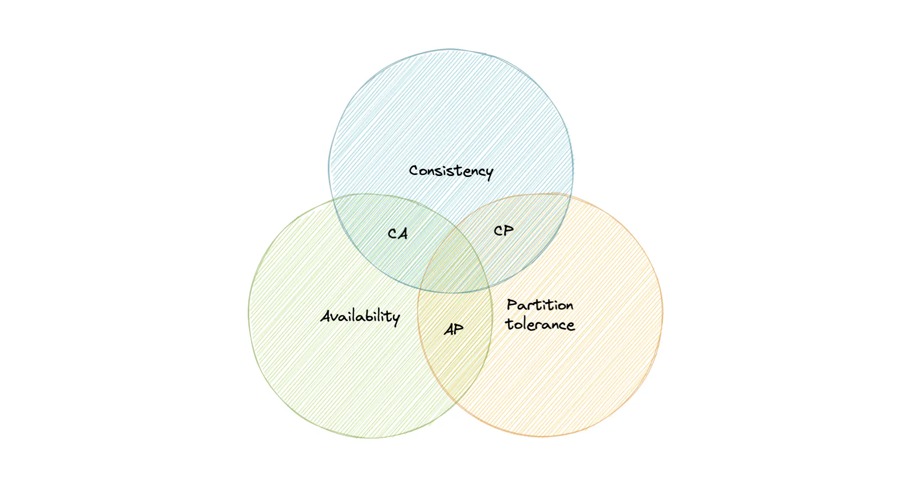
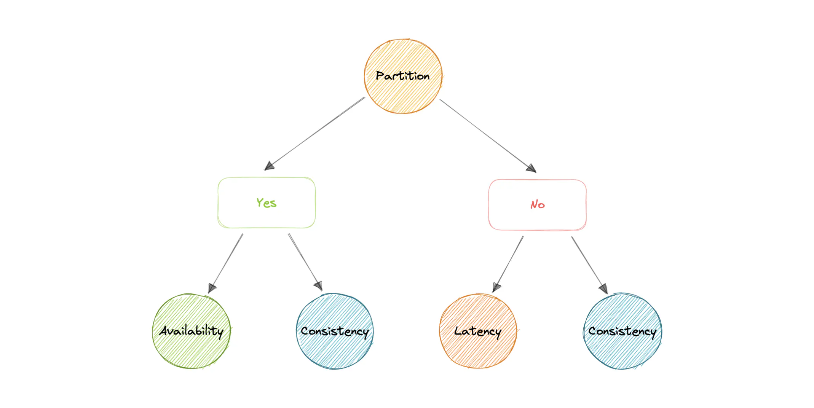

# WHAT IS A DISTRIBUTED SYSTEM?

> “**A distributed system is a collection of autonomous computing elements that appears to its users as a single coherent system.**” - Andrew S. Tanenbaum

An important goal of a distributed system is to make it easy for users (and applications) to access and share remote resources. Resources can be anything from files, databases, and services to computational power. The computers in a distributed system communicate with each other using various communication media, such as a network. The computers in a distributed system are called nodes, and the network that connects them is called the communication network.

## EXAMPLES OF DISTRIBUTED SYSTEMS

1. **Internet**: The Internet is a distributed system that connects millions of computers around the world. The computers in the Internet communicate with each other using the TCP/IP protocol suite.
2. **Banking System**: A banking system is a distributed system that connects multiple bank branches to a central server. The bank branches communicate with the central server to perform transactions, such as deposits and withdrawals.
3. **Version Control Systems**: A version control system, such as Git, is a distributed system that allows multiple developers to collaborate on a software project. The developers communicate with each other using the Git protocol.

# WHY DISTRIBUTED SYSTEMS?

Distributed systems offer several advantages over centralized systems, including:

1. _SCALABILITY_: Distributed systems can scale horizontally by adding more nodes to the system, enabling it to handle a large number of users and requests.
2. _FAULT TOLERANCE_: They are designed to remain operational even if some nodes fail, usually achieved through data replication and service redundancy.
3. _Reliability_: They are reliable because they continue to operate despite failures in some nodes, ensuring that data and services are replicated across multiple nodes.

> Although fault tolerance and reliability are related, they have nuanced differences. Fault tolerance focuses on system stability despite failures, while reliability encompasses broader aspects of system continuity.
>
> 4. _GEO-DISTRIBUTION_: They can be geographically distributed, allowing users to access resources from various locations. This enhances accessibility and reduces latency by locating resources closer to users.

# COMPLEXITY OF DISTRIBUTED SYSTEMS

- **ASYNCHRONOUS NETWORKING**: In a distributed system, nodes communicate with each other asynchronously, meaning that messages can be sent and received at different times. This can lead to issues such as message loss, duplication, and out-of-order delivery. For example, in a distributed chat application, messages might arrive out of order due to network delays.

- **PARTIAL FAILURE**: Nodes in a distributed system can fail independently, leading to partial failures. Handling partial failures requires mechanisms such as fault detection, recovery, and replication. For instance, in a distributed database, if one node fails, the system should be able to continue operating using the remaining nodes.

- **CONCURRENCY CONTROL**: Multiple nodes in a distributed system can access shared resources concurrently. For example, in a distributed banking system, multiple transactions might try to modify the same account balance simultaneously, requiring mechanisms to ensure consistency.

- **STATE MANAGEMENT**: Distributed systems must manage the state of the system across multiple nodes, ensuring consistency and synchronization. For instance, in a distributed online game, the game state must be synchronized across all players' devices.

- **STATEFUL SYSTEMS**: Stateful systems maintain the state of the system across multiple requests, requiring mechanisms to manage stateful interactions. An example is a user session in a web application that persists across multiple page loads.

- **STATELESS SYSTEMS**: Stateless systems do not maintain the state of the system across requests, simplifying scalability and fault tolerance. RESTful APIs are an example of stateless systems, where each request contains all the information needed to process it.

# DISTRIBUTED SYSTEMS ARCHITECTURE

Distributed systems can be classified based on their architecture, which defines how nodes are organized and interact with each other. Common distributed systems architectures include:

1. **CLIENT-SERVER ARCHITECTURE**: In a client-server architecture, clients request services from servers. Servers provide services to clients, such as data storage, processing, or computation. This architecture is commonly used in web applications, where clients (browsers) request web pages from servers (web servers).
2. **PEER-TO-PEER ARCHITECTURE**: In a peer-to-peer architecture, nodes communicate directly with each other without a central server. Each node can act as both a client and a server, sharing resources and services with other nodes. Peer-to-peer architectures are used in file-sharing systems, such as BitTorrent.
3. **MICROSERVICES ARCHITECTURE**: In a microservices architecture, applications are divided into small, independent services that communicate with each other over a network. Each service performs a specific function and can be developed, deployed, and scaled independently. Microservices architectures are used in cloud-native applications to improve scalability and maintainability.

# FALLACIES OF DISTRIBUTED COMPUTING

Peter Deutsch, a computer scientist, identified eight fallacies of distributed computing that developers often overlook when designing distributed systems. These fallacies highlight common misconceptions about distributed systems:

1. **THE NETWORK IS RELIABLE**: Developers often assume that the network is reliable and that messages sent between nodes will be delivered without errors. In reality, networks can experience latency, packet loss, and outages. For example, a mobile app might fail to sync data with its server due to intermittent cellular network connectivity.

2. **LATENCY IS ZERO**: Developers often assume that network latency is zero and that messages are delivered instantaneously. In reality, network latency can vary based on factors such as distance, congestion, and network conditions. For instance, a real-time multiplayer game might experience lag when players are geographically distant from each other.

3. **BANDWIDTH IS INFINITE**: Developers often assume that network bandwidth is infinite and that messages can be sent and received without limitations. In reality, network bandwidth is limited and can be affected by congestion and other factors. For example, a video streaming service might need to adapt its video quality based on the available bandwidth of the user's internet connection.

4. **THE NETWORK IS SECURE**: Developers often assume that the network is secure and that messages sent between nodes are encrypted and protected from eavesdropping. In reality, networks can be vulnerable to security threats. For instance, sensitive data transmitted over an unsecured Wi-Fi network could be intercepted by malicious actors.

5. **TOPOLOGY DOESN'T CHANGE**: Developers often assume that the network topology is static and that nodes are always connected. In reality, network topologies can change dynamically due to node failures, network partitions, and other factors. For example, in a mobile ad-hoc network (MANET), the network topology can change as devices move in and out of range of each other.

6. **THERE IS ONE ADMINISTRATOR**: Developers often assume that there is a single administrator responsible for managing the entire network. In reality, distributed systems can have multiple administrators with different levels of control and authority. For instance, in a cloud-based system, responsibilities might be shared between the cloud provider and the customer's IT team.

7. **TRANSPORT COST IS ZERO**: Developers often assume that the cost of transporting messages across the network is zero. In reality, transporting messages can incur costs such as bandwidth usage, network fees, and processing overhead. For example, a mobile app that frequently syncs large amounts of data might consume excessive cellular data, leading to additional costs for users.

8. **THE NETWORK IS HOMOGENEOUS**: Developers often assume that the network is homogeneous and that all nodes have similar capabilities and performance. In reality, networks can be heterogeneous, with nodes having different hardware, software, and configurations. For instance, a web application might need to support various browsers and devices with different capabilities and screen sizes.

## THEOREMS OF DISTRIBUTED SYSTEMS

1. **CAP THEOREM**: The CAP theorem states that in a distributed system, it is impossible to simultaneously achieve consistency, availability, and partition tolerance. A system can only guarantee two out of the three properties at any given time.

- **Consistency**: All nodes in the system have the same data at the same time.
- **Availability**: The system remains operational and responsive to user requests.
- **Partition Tolerance**: The system can tolerate network partitions and communication failures. (network partitions are when nodes in a distributed system are unable to communicate with each other i.e. the network is partitioned)

> **CAP Theorem:** Consistency, Availability, and Partition Tolerance are the three properties of a distributed system. A system can only guarantee two out of the three properties at any given time.
> When there is a network partition, a distributed system must choose between consistency and availability. It can either be consistent and unavailable or available and inconsistent until the partition is resolved.

    ### Example:

Let's say we have a tiny bank with 2 ATMs connected over a network. The ATMs support 3 operations: deposit, withdraw, and check balance. The bank wants to ensure that the ATMs are always available to customers and that the account balance is consistent across both ATMs. However, if the network between the ATMs fails, the bank must choose between consistency and availability. If it prioritizes consistency, the ATMs will be unavailable until the network is restored. If it prioritizes availability, the ATMs will remain operational but may have inconsistent account balances.

2. **PACELC THEOREM**: The PACELC theorem extends the CAP theorem by introducing latency and consistency trade-offs. In a distributed system, developers must choose between consistency and latency when handling network partitions.

- **PACELC**: Consistency, Latency, and Availability in the presence of network partitions, Latency, and Consistency trade-offs.

> **PACELC Theorem:** Partition Tolerance, Availability, Consistency, Else, Latency, Consistency trade-offs. Developers must choose between consistency and latency when handling network partitions.

    ### Example:

Let's say we have a social media platform where users can post updates and comments. The platform wants to ensure that posts are consistent across all users' feeds and that comments are displayed in real-time. However, if there is a network partition, the platform must choose between consistency and latency. If it prioritizes consistency, posts will be delayed until the partition is resolved. If it prioritizes latency, posts will be displayed immediately but may be inconsistent across users' feeds.

> **PACELC** extends the CAP theorem by introducing latency (L) as an additional attribute of a distributed system. The theorem states that else (E), even when the system is running normally in the absence of partitions, one has to choose between latency (L) and consistency (C).

    For example, according to the CAP theorem, a database can be considered available if a query returns a response after 30 days. Obviously, such latency would be unacceptable for any real-world application.
