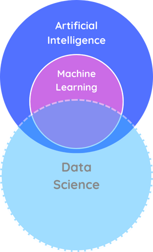
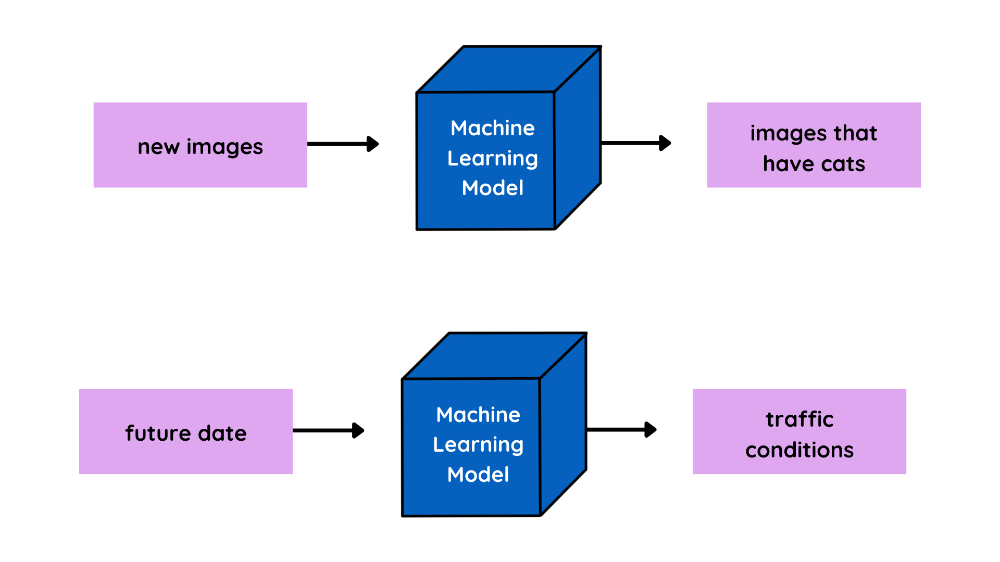
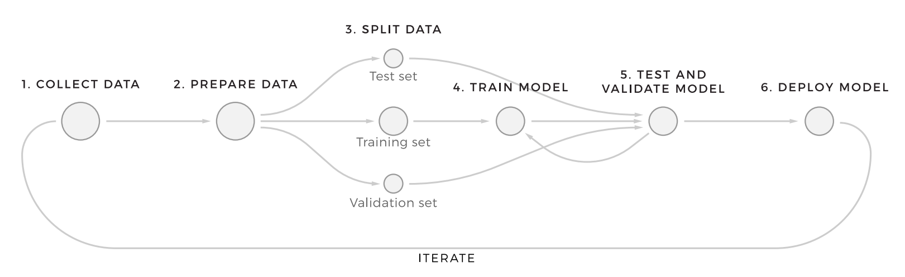

If the past few years hasn't found you living on a desert island without electricity or communication with the outside world, you've likely heard about ChatGPT, AlphaGo or self-driving cars. It's hard to miss the trend. Every time we talk about these things, we're discussing some implementation of machine learning (ML). But what is Machine Learning? and how does it work?

# Clarifying the terms

When you look up machine learning, you may encounter the terms **Artificial intelligence (AI)** and **Data Science**. These fields often overlap and complement each other in real-world applications, but they have distinct focuses and purposes.

Today, when people refer to AI, they're most likely referring to machine learning but AI is a huge set of tools and techniques that allows machines to display **_intelligence_**, similar to humans. It comprises of several sub-fields, including robotics and machine learning.

On the other hand, data science deals with gathering insights from datasets. Traditionally, data scientists have used statistical methods for gathering these insights. However, as machine learning continues to grow, it has also penetrated into the field of data science, especially for making predictions from data.

  

# Defining machine learning

Defining machine learning is not simple. Machine learning has many applications and overlaps with several other fields as we mentioned before. Combined with the rapid growth of machine learning as a field, the boundaries of machine learning can be blurry, but we like to define machine learning as a set of tools for making inferences and predictions from data.

## What can it do?

1. **Predict** future events
   - Will it rain tomorrow?
     - Yes (75% probability)
   - Will the stock market close higher tomorrow?
     - Yes (60% probability, based on historical market trends, current economic indicators, and sentiment analysis of financial news)
2. **Infer** the causes of events and behaviors
   - Why does it rain?
     - Time of the year, humidity levels, temperature, location, etc
   - Why did the website experience a traffic spike yesterday?
     - Factors include a viral social media post, a new product launch, and a successful email marketing campaign.
3. **Infer** patterns
   - What are the different types of weather conditions?
     - Rain, sunny, overcast, fog, etc
   - What are the common customer segments for an e-commerce platform?
     - Segments include occasional shoppers, frequent buyers, bargain hunters, and luxury consumers, based on shopping history, browsing behavior, and demographic data.

## How does it work?

Machine learning methods are primarily derived from statistics and computer science. Machine learning is extremely powerful because it gives machines the ability to learn without being explicitly programmed to do so. Meaning, the engineer isn't required to provide elaborate instructions to a machine on how to treat each type of data record. Instead a machine defines these rules itself relying on input data. For example, it can process archived emails to learn what spam looks like on its own. Then, using what it learned, it can detect spam in new emails. Also for machine learning to be successful, it needs high-quality data. As the saying goes:

> _Garbage in, garbage out_

We've defined machine learning, but what does it look like in practice? The answer lies in machine learning models. A machine learning model can be thought of as a mathematical representation of a real-world process, derived from the patterns and relationships discovered within the data. These models serve as the heart of machine learning systems. For instance, a model trained on millions of cat images can recognize cats in new images it has never seen before. Similarly, a model trained on historical traffic data can predict hourly traffic patterns in a city.

# Types of machine learning

1. **Reinforcement learning**
2. **Supervised learning**
3. **Unsupervised learning**

Reinforcement learning is perhaps the most sophisticated style of machine learning and is inspired by game theory and behaviorist psychology. An **agent** (an algorithm) must make decisions based on input data and then be **awarded** or **punished**, depending on how successful these decisions were. By iteratively facing awards and punishments, the agent alters its decisions and gradually learns to achieve better results.

> This type of machine learning is actively used in robotics and AI development.

](./mathworks-reinforcement-learning-fig1-543.jpg)

The other types of machine learning and most common types are supervised and unsupervised learning. Their main difference lies in their training data. In supervised learning, the training data is **labeled**, meaning the algorithm is provided with examples of correct outcomes. By learning from labeled data, the algorithm becomes proficient at making predictions for new, unlabeled data, effectively replicating the patterns it has seen. On the other hand, unsupervised learning deals with unlabeled data because data doesn't always come with labels. So unsupervised learning focuses on discovering inherent patterns and structures within data without explicit guidance.

# Machine learning workflow

Up until now, we've established that training data is used to let a model learn, then that model can be used to make predictions, Et voilà that’s how the magic of machine learning works. But, what are the steps in between?

## Step 1: Data Collection

To start the machine learning process, we need first to the data, This data can come from a variety of places, ranging from open-source online resources to paid crowdsourcing. The first step of the machine learning process is arguably the most important. If the data you collect is poor quality or irrelevant, then the model you train will be poor quality as well.

## Step 2: Data Processing and Preparation

Next, we need to process the data and make sure that it is in a usable format for machine learning, imputing missing values, analyzing wrong-labeled data, removing outliers, and reducing the noise.

## Step 3: Split Data

Separate subsets of data to 3 subsets; one to train the model and the other two to test and evaluate how it performs against new data.

## Step 4: Choosing the right model

Once the data is prepared, the next step is to choose a machine learning model. There are many types of models to choose from, including linear regression, decision trees, and neural networks. The choice of model depends on the nature of your data and the problem you're trying to solve.

## Step 5: Model Training

After choosing a model, the next step is to train it using the prepared data. Training involves feeding the data into the model and allowing it to adjust its internal parameters to better predict the output.

## Step 6: Model Evaluation

## Step 7: Model Deployment

## Step 8: Iteration

We will constantly need to collect new data, and repeating this process in order increment improve our model.

---

### **Resources:**

- [DataCamp - What is Machine Learning?](https://www.datacamp.com/blog/what-is-machine-learning)
- [Whitepaper - Bridging Between Business and Data Science](https://www.altexsoft.com/whitepapers/machine-learning-bridging-between-business-and-data-science/)
