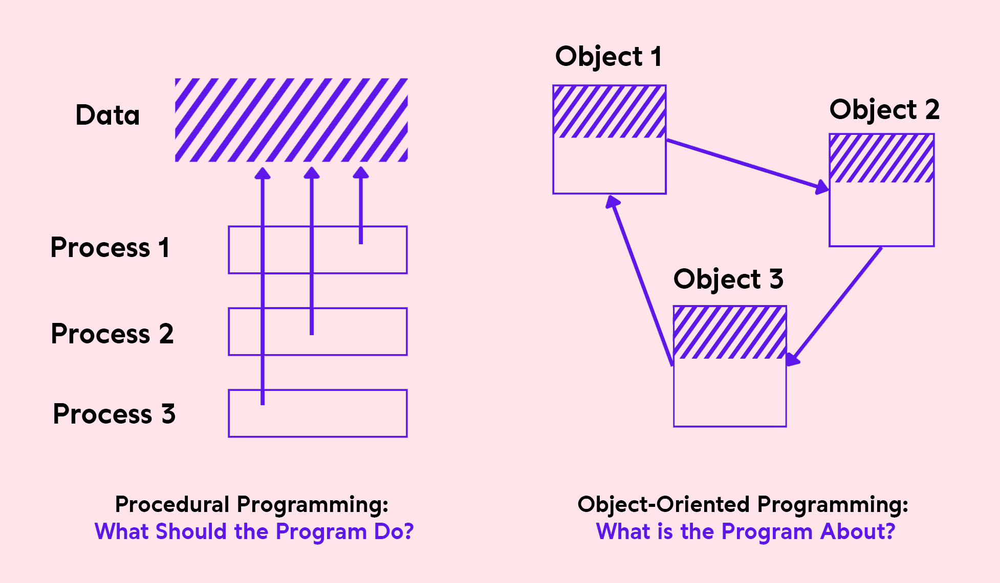

Just like many of us, I began my coding journey with procedural programming. It's like learning the basics of handling a bicycle before even thinking about a motorcycle. It's straightforward and logical, making it an excellent starting point for anyone new to programming. However, as you progress and your projects become more complex, you'll inevitably encounter the need for a more sophisticated toolset – that's where Object-Oriented Programming (OOP) comes into play.

## What is OOP?

It is a paradigm that consists of modeling a problem with a set of objects:

> **OOP** ≡ (**SET OF OBJECTS AND THE INTERACTIONS BETWEEN THESE OBJECTS**)

- An object represents a concept, an idea, or any entity from the physical world (a car, a person, or even a page of a book).
- OOP is easily conceivable because it describes entities as they exist in the real world.
- The program is built around objects that combine data (**_attributes_**) and actions (**_methods_**).

> **Advantages of OOP:** ease of organization, reusability, inheritance capability, ease of correction, easier to manage projects.

- OOP allows securing a program by either allowing or prohibiting access to these objects by other parts of the program.

## What is an Object?

It is a data structure responsible for managing data, organizing it, and storing it in a certain form:

> **OBJECT** ≡ **IDENTITY** + **STATE** (attributes) + **BEHAVIOR** (member methods)

- **Identity**: An object has an identity that allows it to be distinguished from other objects, regardless of its state.
- **Attributes**: These are the data characterizing the object. They are variables that store information about the object's state.
- **Methods** (member functions): An object's methods characterize its behavior, i.e., the set of actions that allow:
  - To **consult**, **modify**, etc.… the object's state (the values of the attributes),
  - To **communicate** with other objects by sending messages to perform a process...

- Communications between objects are synchronous: The calling object waits for a response before being able to do something else.

## What is a Class?

Objects of the same nature belong to the same family called Class:

> **CLASS** ≡ (**Abstraction of a set of objects sharing a common structure and common behavior**)

> **CLASS** ≡ **INSTANTIATION** + **ATTRIBUTES** (instance variables) + **MEMBER METHODS**

- **Instantiation**: represents the relationship between an object and its belonging class that allowed its creation.
- **Attributes** (also called instance variables): They have a name and a type: either a **basic type** (simple or constructed), or a **class** (the attribute references an object of the same or another class).
- **Member methods**: They are the operations applicable to an object of the class. They can modify all or part of an object's state and return calculated values based on that state.

## Inheritance:

**Inheritance** (class derivation): the mechanism that allows creating a class **_(derived class, subclass, or child class)_** from an existing class **(superclass or parent class)**.

> **Inheritance** ≡ (**Generalization**/**Specialization** relationship between classes)

- Inheritance is like passing down family traits from one generation to the next. Children inherit characteristics, skills, and sometimes even responsibilities from their parents.

### Types of Inheritance

- **Single Inheritance**: a class can inherit only one superclass.
- **Multiple Inheritance**: some object-oriented languages, such as C++, allow for multiple inheritance, which means they offer the possibility of inheriting a class from two or more superclasses. This technique allows grouping attributes and methods of multiple classes into a single class.

- **Example**: Think of a family tree where the superclass represents common traits passed to all descendants.

## Polymorphism:

It is the object's ability to belong to multiple classes:

> **POLYMORPHISM** ≡ (**OBJECT'S ABILITY TO HAVE MULTIPLE FORMS**)

- Polymorphism is like a universal remote control. It doesn't matter what brand or model your TV is; the remote can control them all. In programming, polymorphism allows you to interact with different objects in a consistent way, regardless of their specific types.

### Types of Polymorphism

- Ad-hoc polymorphism (**overloading**)
- Parametric polymorphism (**generics**)
- Inheritance polymorphism (**overriding**)

## Encapsulation:

It is a mechanism (also called abstraction) that involves grouping data and methods within a structure while hiding the object's implementation.

> **ENCAPSULATION** ≡ **DATA PROTECTION** (public or private)

- Encapsulation is like a car's dashboard. When you drive a car, you don't need to know how the engine works; you interact with the dashboard, which provides access to essential controls while hiding the complex machinery underneath.

- Encapsulation allows defining visibility levels for class elements to provide access rights to data via a method of the class itself, a subclass, or any class.

### Visibility Levels

- **Public**: functions from all classes can access the data or methods of a class defined with public visibility.
- **Protected**: only member functions of the subclass and its descendants can access the data.
- **Private**: only methods of the class itself can access the data.

- These visibility levels are like different levels of access to the dashboard controls: public (anyone can use them), protected (only authorized users), and private (only the driver).
